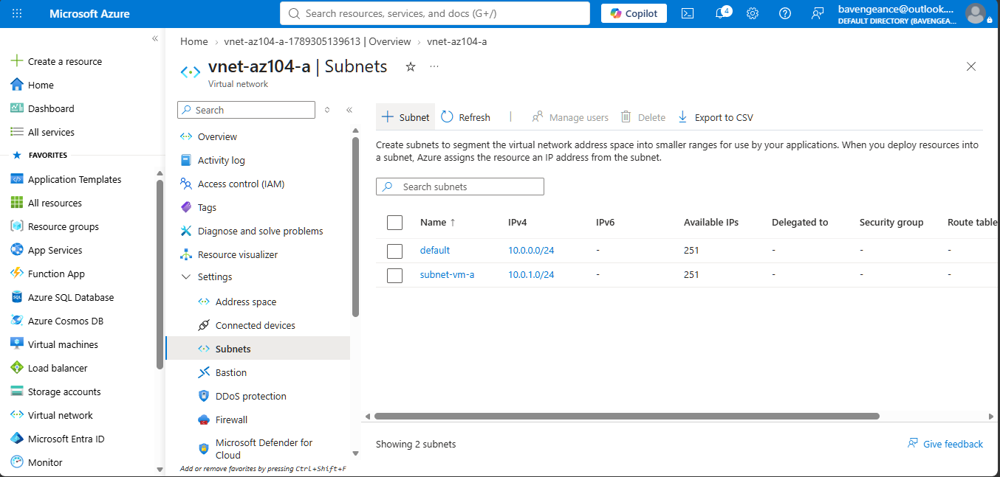
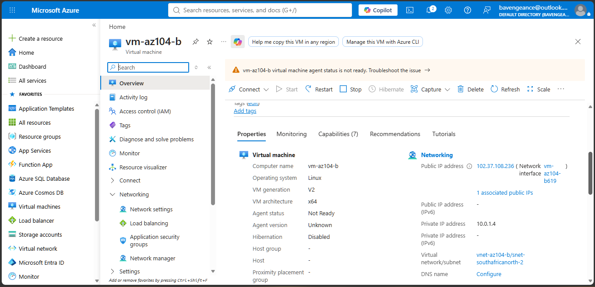
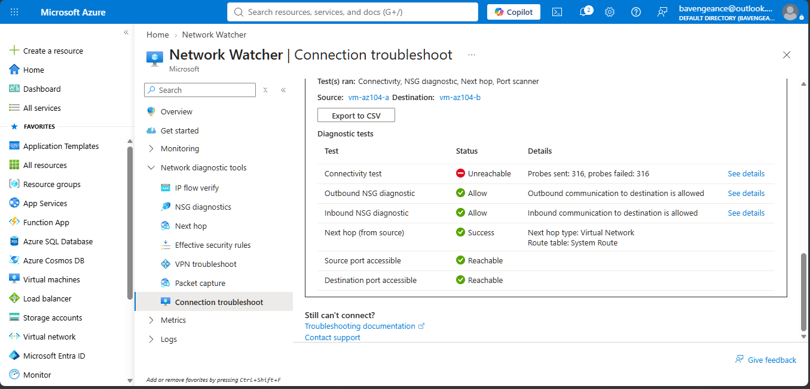
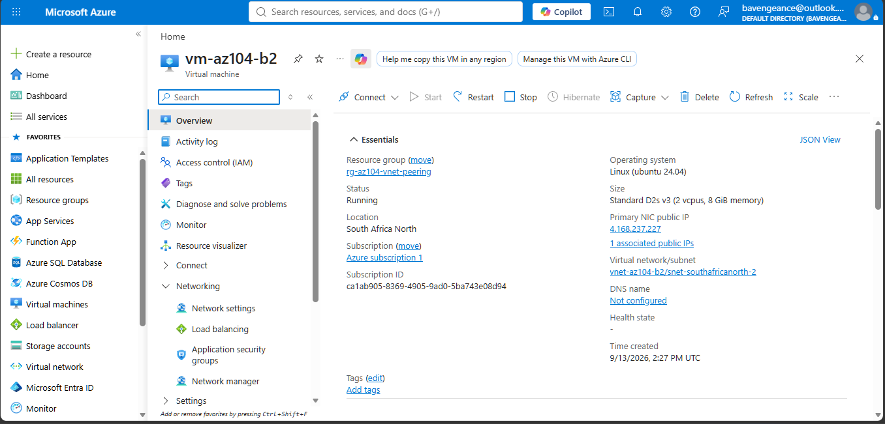
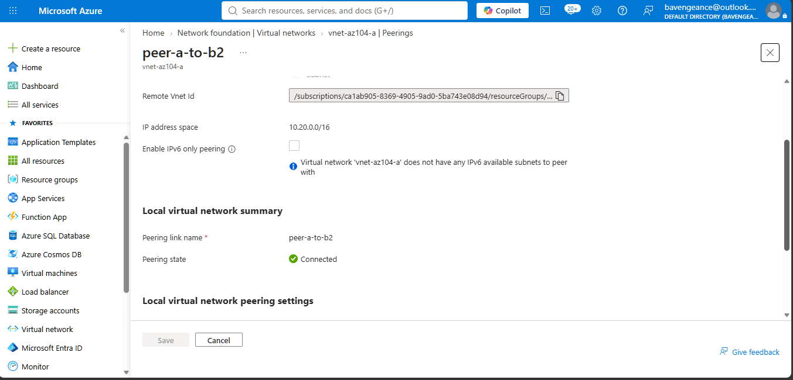
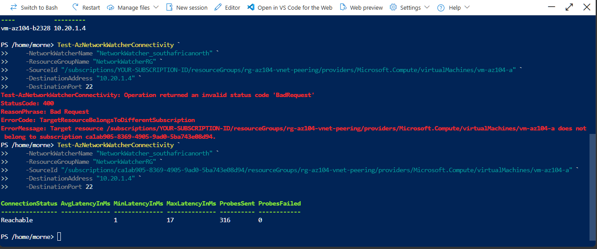

# Azure Virtual Network Peering & Custom Routing Lab

## Overview

This hands-on **Microsoft Azure AZ-104** project demonstrates practical Azure networking and administration skills.

The lab covers Azure Virtual Networks, subnets, virtual machines, Network Watcher, VNet peering, Azure PowerShell, route tables, and User Defined Routing (UDR).

The project also included identifying and resolving an overlapping VNet address-space configuration before successfully establishing VNet peering.

---

## Objectives

* Create Azure Virtual Networks and subnets
* Deploy virtual machines into separate VNets
* Test network connectivity using Azure Network Watcher
* Configure VNet peering
* Identify and resolve overlapping VNet address spaces
* Validate connectivity before and after peering
* Use Azure PowerShell for network testing
* Create a custom route table
* Configure a User Defined Route (UDR)
* Associate networking resources with Azure subnets
* Apply practical Azure networking concepts

---

## Architecture

```text
                    Azure Subscription
                           |
              +------------+------------+
              |                         |
          VNet-A                     VNet-B2
       10.0.0.0/16                10.20.0.0/16
              |                         |
          VM-A                         VM-B2
              |                         |
              +------ VNet Peering ----+
                       Connected
```

### Network Configuration

| Component             | Configuration           |
| --------------------- | ----------------------- |
| Resource Group        | `rg-az104-vnet-peering` |
| Region                | South Africa North      |
| VNet-A                | `vnet-az104-a`          |
| VNet-A Address Space  | `10.0.0.0/16`           |
| VM-A                  | `vm-az104-a`            |
| VNet-B2               | `vnet-az104-b2`         |
| VNet-B2 Address Space | `10.20.0.0/16`          |
| VM-B2                 | `vm-az104-b2`           |
| Route Table           | `rt-az104-custom`       |
| Custom Route          | `172.31.0.0/16`         |
| Next Hop Type         | `None`                  |

---

# 1. Azure Virtual Network Deployment

The first stage involved creating the Azure networking environment and deploying a virtual machine into the first virtual network.

### VNet-A

`vnet-az104-a`

Address space:

`10.0.0.0/16`



### VM-A

`vm-az104-a`


---

# 2. Second Virtual Network and VM

An initial second virtual network and virtual machine were created as part of the networking exercise.



---

# 3. Connectivity Testing Before Peering

Azure **Network Watcher** was used to test connectivity between the virtual machines before VNet peering was configured.

The connectivity test returned:

**Unreachable**

This demonstrated that there was no network path between the separate VNets at that stage.

The Network Watcher diagnostics also helped confirm that the tested traffic was not simply being blocked by the NSGs.



---

# 4. Resolving Overlapping VNet Address Spaces

During the lab, the initial second VNet used an address space that overlapped with VNet-A.

Both networks were using:

`10.0.0.0/16`

Azure does not allow VNet peering between VNets with overlapping address spaces.

To resolve this configuration issue, a new VNet was created using a non-overlapping address space:

**VNet-B2**

`vnet-az104-b2`

Address space:

`10.20.0.0/16`

A new VM was then deployed into the corrected VNet.



---

# 5. VNet Peering

VNet peering was configured between:

```text
vnet-az104-a
        |
        | VNet Peering
        |
vnet-az104-b2
```

The peering status became:

**Connected**



---

# 6. Connectivity Testing After Peering

Network Watcher was used again to validate connectivity between VM-A and VM-B2 after the peering configuration.

The test used TCP connectivity on port **22 (SSH)**.

The result was:

**Reachable**

This confirmed successful network connectivity between the peered VNets.

![Network Watcher After Peering]07-network-watcher-after-peering.png)

### Connectivity Results

| Stage               | Result      |
| ------------------- | ----------- |
| Before VNet Peering | Unreachable |
| VNet Peering        | Connected   |
| After VNet Peering  | Reachable   |

---

# 7. Azure PowerShell

Azure PowerShell was used as an additional method of interacting with and validating the Azure networking environment.

This provided practical experience working with Azure resources through both the **Azure Portal and PowerShell**.



---

# 8. Custom Routing

A custom Azure route table was configured to demonstrate **User Defined Routing (UDR)**.

The route table used for the exercise was:

`rt-az104-custom`

A custom route was created using an unused test network address space.

### Custom Route

| Setting       | Value                  |
| ------------- | ---------------------- |
| Route Name    | `route-blackhole-test` |
| Destination   | `172.31.0.0/16`        |
| Next Hop Type | `None`                 |

The unused destination was selected so the custom route would not interfere with the working VNet peering configuration.


---

# Skills Demonstrated

## Azure Networking

* Azure Virtual Networks
* Subnets
* IP address spaces
* VNet peering
* Network security concepts
* System routing
* User Defined Routing
* Route tables
* Network connectivity validation

## Azure Administration

* Resource Groups
* Azure Virtual Machines
* Azure Portal
* Network Watcher
* Network interface configuration
* Azure resource management

## Troubleshooting & Problem Solving

* Identifying overlapping VNet address spaces
* Understanding why VNet peering could not initially be established
* Correcting the network design
* Validating connectivity before and after configuration
* Using Azure network diagnostics to investigate connectivity

## PowerShell

* Azure PowerShell
* Azure resource queries
* Network connectivity testing

---

# Key Learning Outcomes

This project provided practical experience with how Azure networking components work together.

### Key concepts learned

1. Azure VNets require appropriate IP address planning when peering is required.
2. Overlapping VNet address spaces prevent VNet peering.
3. VNet peering provides private connectivity between separate Azure VNets.
4. Network Watcher can be used to validate network connectivity.
5. NSGs and routing are separate networking components that can affect traffic.
6. User Defined Routes can influence how traffic is handled within an Azure network.
7. Azure resources can be managed through both the Azure Portal and PowerShell.
8. Network configuration issues can be identified and corrected through practical testing.

---

# Lab Cleanup

After completing the lab and capturing the required evidence, the temporary lab resource group was deleted to avoid unnecessary ongoing Azure costs.

Resource group:

`rg-az104-vnet-peering`

This removed the temporary virtual machines and networking resources used for the exercise.

---

# AZ-104 Areas Covered

This project supports practical learning in the following AZ-104 areas:

* Configure virtual networking
* Configure network security
* Configure Azure Virtual Machines
* Monitor and validate Azure networking
* Configure network routing
* Use Azure PowerShell
* Manage Azure resources

---

# Project Status

**Completed**

This project was created as part of my hands-on preparation for the **Microsoft Azure Administrator (AZ-104)** certification.

The focus was on developing practical Azure administration skills through hands-on configuration, testing, problem solving, and validation.

---

## Author

**Morne Coetzee**

Azure Administrator / Cloud Engineering Portfolio
